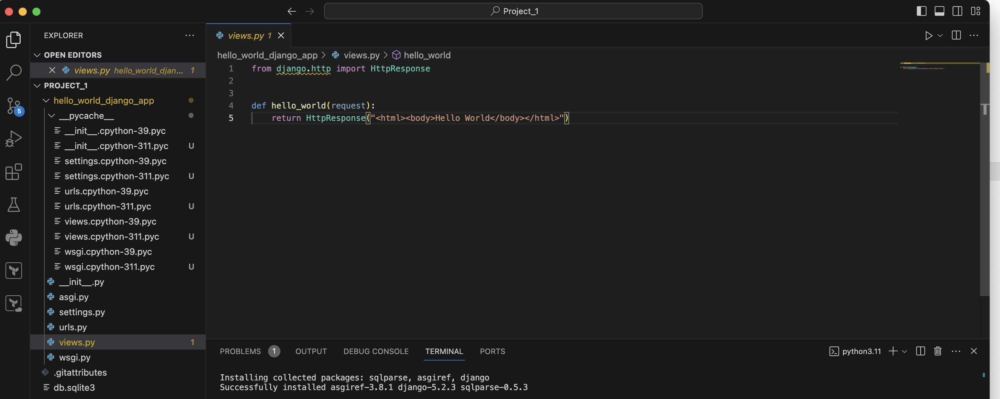

# 🚀 DevOps Project 1 – Deploy Django App on AWS using ECS & ECR

This project demonstrates how to containerize and deploy a Django-based web application using **Docker**, **Amazon ECR**, and **Amazon ECS (Fargate)**.

---

## 🛠️ Tech Stack

- Django
- Docker
- AWS ECS (Fargate)
- AWS ECR
- CloudWatch Logs
- ALB (Load Balancer)

---

## 📁 Step 1: Python Project – Django App Overview

This project starts with a functional **Python-based Django web application**, developed to serve a basic "Hello World" page. The goal is to take this working local application and deploy it using a modern DevOps pipeline involving:

The source code includes:
- `manage.py` for Django CLI
- A custom Django app (`hello_world_django_app`)
- `requirements.txt` for containerization




### ✅ Run the App Locally (for verification)

```bash
# Install dependencies (recommend using virtualenv)
pip install -r requirements.txt

# Run the development server
python manage.py runserver

